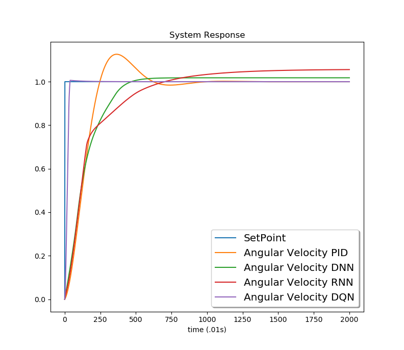

# DCmotor_Control - University Project
#Simple DC electric motor with a speed controller.  The aim of this code is to compare various modes of Machine Learning Control with classic PID control.  Speed controller has the option of using a PID, Dense NN, LSTM, and a DQN controller. The main code is in Main_Object.  It requrires trained .h5 files from the three _Controller.py files, and the DCmotor.py file to run.  Run the PID control section to generate training data for the ML training sections.  The DQN training interacts directly with the motor model DCmotor.py

